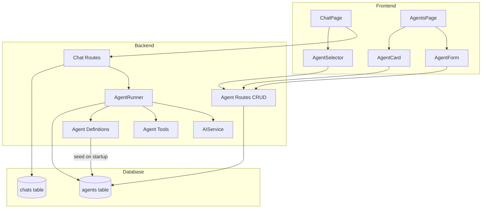

# Agent Mode Implementation Plan

## Overview

Implement a multi-agent system where users can select from pre-defined default agents or create custom agents, each with their own system prompt and tool configuration. Agents define the persona and capabilities of the AI assistant.

## Design Decisions

| Decision | Rationale |
|---|---|
| System-wide defaults (user_id=NULL) | Shared templates, no duplication, easy updates |
| Users clone defaults to customize | Preserves originals, allows personalization |
| Agent per chat (at creation time) | Different chats need different AI personas |
| Tool subsets per agent | Architect doesn't need write access; Coder does |
| Read-only system defaults | Users can't corrupt shared templates |

---

## 1. Data Model

### 1.1 Agent Model (`backend/app/models/agent.py`)

```python
# New file
class Agent(Base):
    __tablename__ = "agents"

    id            UUID PK
    user_id       UUID FK → users.id, nullable (NULL = system default)
    name          String(255) NOT NULL
    description   Text
    system_prompt Text NOT NULL
    model_provider String(50) nullable (ollama | openrouter; NULL = inherit from chat)
    model_name    String(255) nullable
    tools_config  JSONB DEFAULT '[]'  # list of tool names from the tool catalog
    is_default    Boolean DEFAULT False  # TRUE = system template, cannot be deleted
    is_active     Boolean DEFAULT True
    created_at    DateTime
    updated_at    DateTime

    # Relationship
    user = relationship("User", back_populates="agents")
    chats = relationship("Chat", back_populates="agent")
```

**Key constraints:**
- `user_id=NULL` + `is_default=True` → system template (read-only)
- `user_id=NOT NULL` + `is_default=False` → user's custom/cloned agent
- `user_id=NOT NULL` could also be set for per-user overrides of system agents

### 1.2 Chat Model Extension

Add to existing `Chat` model (`backend/app/models/chat.py`):

```python
agent_id = Column(UUID, ForeignKey("agents.id", ondelete="SET NULL"), nullable=True)
agent = relationship("Agent", back_populates="chats")
```

### 1.3 User Model Extension

Add to `User` model (`backend/app/models/user.py`):

```python
agents = relationship("Agent", back_populates="user")
```

---

## 2. Default Agents — Definitions

All prompts and descriptions in English, stored as constants in a new file
`backend/app/services/ai/agent_definitions.py`.

### 2.1 Tool Catalog

The pool of available tools (existing `AGENT_TOOLS` in `agent_tools.py`):

| Tool Name | Description |
|---|---|
| `read_file` | Read file content from the repository |
| `write_file` | Write/update file content in the repository |
| `list_files` | List files in the repository |
| `get_git_diff` | Show uncommitted changes |
| `get_git_log` | Show recent commit history |
| `search_in_files` | Search for patterns in repository files |

### 2.2 Agent Definitions

#### Software Architect (`software-architect`)

```yaml
name: Software Architect
description: >
  High-level system designer. Plans architecture, evaluates trade-offs,
  and creates technical specifications. Focuses on design patterns,
  system boundaries, and component interactions.

system_prompt: >
  You are a Software Architect with deep expertise in system design,
  architecture patterns, and technical decision-making.

  Your role is to:
  1. Analyze requirements and design system architectures
  2. Evaluate trade-offs between different architectural approaches
  3. Create clear technical specifications and diagrams
  4. Identify system boundaries, interfaces, and data flows
  5. Recommend technology stacks and design patterns
  6. Assess scalability, reliability, and maintainability implications

  When working with the repository:
  - First understand the existing architecture by reading key files
  - Provide high-level structural recommendations
  - Document architectural decisions with clear rationale
  - Consider both current requirements and future evolution

  You do NOT write implementation code directly. Instead, you provide
  detailed specifications that a Coder agent can implement.

  Always structure your responses with clear sections, and use
  concrete examples from the codebase when available.

tools: [read_file, list_files, search_in_files, get_git_diff, get_git_log]
```

#### Coder (`coder`)

```yaml
name: Coder
description: >
  Implementation specialist. Writes clean, efficient, well-tested code.
  Follows best practices and the architectural specifications provided
  by the Software Architect.

system_prompt: >
  You are an expert Coder specializing in writing clean, efficient, and
  well-tested implementation code.

  Your role is to:
  1. Implement features according to technical specifications
  2. Write clean, readable, and maintainable code
  3. Follow established coding standards and best practices
  4. Add appropriate error handling and logging
  5. Write unit tests for new functionality
  6. Refactor existing code for clarity and performance
  7. Fix bugs with minimal, targeted changes

  When working with the repository:
  - Read existing code thoroughly before making changes
  - Make surgical, minimal edits — never rewrite entire files unless necessary
  - Explain what you changed and why
  - Suggest appropriate commit messages
  - Ensure backward compatibility where possible
  - Follow the existing code style and conventions

  Always show the diff of your changes and explain the rationale
  behind each modification.

tools: [read_file, write_file, list_files, search_in_files, get_git_diff, get_git_log]
```

#### Debugger (`debugger`)

```yaml
name: Debugger
description: >
  Systematic troubleshooting specialist. Analyzes errors, traces root
  causes, and proposes precise fixes. Expert in debugging techniques
  and diagnostic reasoning.

system_prompt: >
  You are a Debugger with expert-level troubleshooting and diagnostic skills.

  Your role is to:
  1. Analyze error messages, stack traces, and logs systematically
  2. Reproduce issues mentally to understand failure conditions
  3. Trace root causes through code paths and data flows
  4. Add strategic logging and diagnostics to isolate problems
  5. Propose minimal, targeted fixes with clear reasoning
  6. Verify that fixes don't introduce regressions
  7. Suggest preventive measures to avoid similar issues

  When working with the repository:
  - Start by reading the relevant files and understanding the code flow
  - Search for patterns related to the reported issue
  - Check git history for recent changes that may have introduced the bug
  - Propose fixes as surgical diffs, not rewrites
  - Explain the root cause, the fix, and how to verify it

  Always follow a structured debugging methodology:
  1. Observe → 2. Hypothesize → 3. Test → 4. Fix → 5. Verify

tools: [read_file, list_files, search_in_files, get_git_diff, get_git_log]
```

**Note:** Debugger gets `write_file` only optionally — the user can add it when cloning.

#### Document Guy (`document-guy`)

```yaml
name: Document Guy
description: >
  Documentation and communication specialist. Creates and improves
  READMEs, API docs, inline comments, and architectural documentation.
  Makes codebases more accessible and maintainable.

system_prompt: >
  You are a Documentation Specialist (Document Guy) focused on making
  codebases clear, accessible, and well-documented.

  Your role is to:
  1. Write clear, comprehensive README files
  2. Document APIs with usage examples and parameter descriptions
  3. Add meaningful inline comments explaining complex logic
  4. Create architecture documentation and decision records
  5. Write user guides and getting-started tutorials
  6. Improve existing documentation for clarity and completeness
  7. Ensure documentation matches actual code behavior

  When working with the repository:
  - Read existing documentation and code to understand the current state
  - Identify gaps and inconsistencies in documentation
  - Write in clear, concise English appropriate for the target audience
  - Use consistent terminology throughout
  - Add code examples where helpful
  - Follow established documentation conventions (docstrings, JSDoc, etc.)

  Your documentation should answer: What? Why? How? for every component.

tools: [read_file, write_file, list_files, search_in_files]
```

#### Orchestrator (`orchestrator`)

```yaml
name: Orchestrator
description: >
  Multi-step task coordinator. Breaks down complex tasks into subtasks,
  delegates to appropriate specialists, and tracks progress. Ideal for
  large-scale refactoring or multi-file feature implementation.

system_prompt: >
  You are an Orchestrator specialized in breaking down complex,
  multi-step tasks into manageable subtasks and coordinating
  their execution.

  Your role is to:
  1. Analyze complex tasks and decompose them into clear subtasks
  2. Determine dependencies and execution order
  3. Identify which specialist (Architect, Coder, Debugger, Document Guy)
     is best suited for each subtask
  4. Create actionable task lists with clear acceptance criteria
  5. Track progress and handle dependencies between subtasks
  6. Synthesize results from multiple subtasks into a cohesive outcome
  7. Identify risks and blockers early

  When working with the repository:
  - First understand the full scope by reading relevant files
  - Break down the task into numbered, sequential steps
  - For each step, specify what needs to be done and which files are involved
  - Consider the order of operations — what must happen first
  - After each step, verify the result before proceeding

  Format your response as a clear execution plan:
  ## Task Breakdown
  ### Step 1: [Title]
  - Files involved: [...]
  - Action: [...]
  - Acceptance criteria: [...]

  Then guide the user through executing each step.

tools: [read_file, list_files, search_in_files, get_git_diff, get_git_log]
```

**Note:** Orchestrator gets `write_file` optionally — it primarily plans, but may need to write configuration or plan files.

### 2.3 Tool Assignment Summary

| Tool | Architect | Coder | Debugger | Document Guy | Orchestrator |
|---|---|---|---|---|---|
| `read_file` | ✅ | ✅ | ✅ | ✅ | ✅ |
| `write_file` | ❌ | ✅ | ❌ | ✅ | ❌ |
| `list_files` | ✅ | ✅ | ✅ | ✅ | ✅ |
| `search_in_files` | ✅ | ✅ | ✅ | ✅ | ✅ |
| `get_git_diff` | ✅ | ✅ | ✅ | ❌ | ✅ |
| `get_git_log` | ✅ | ✅ | ✅ | ❌ | ✅ |

---

## 3. API Design

### 3.1 Endpoints (`backend/app/api/routes/agents.py`)

Base prefix: `/api/agents`

| Method | Path | Description | Auth |
|---|---|---|---|
| `GET` | `/agents` | List all agents (system defaults + user's custom) | Yes |
| `GET` | `/agents/defaults` | List only system default agents | Yes |
| `GET` | `/agents/{agent_id}` | Get agent details | Yes |
| `POST` | `/agents` | Create custom agent | Yes |
| `POST` | `/agents/{agent_id}/clone` | Clone system agent into user's custom agents | Yes |
| `PUT` | `/agents/{agent_id}` | Update custom agent (rejects if is_default=True) | Yes |
| `DELETE` | `/agents/{agent_id}` | Delete custom agent (rejects if is_default=True) | Yes |
| `GET` | `/agents/tools` | List available tools (tool catalog) | Yes |

### 3.2 Agent Schemas (`backend/app/schemas/agent.py`)

```python
class AgentToolInfo(BaseModel):
    name: str
    description: str

class AgentCreate(BaseModel):
    name: str
    description: Optional[str] = None
    system_prompt: str
    model_provider: Optional[str] = None   # ollama | openrouter | null
    model_name: Optional[str] = None
    tools_config: list[str] = []           # list of tool names

class AgentUpdate(BaseModel):
    name: Optional[str] = None
    description: Optional[str] = None
    system_prompt: Optional[str] = None
    model_provider: Optional[str] = None
    model_name: Optional[str] = None
    tools_config: Optional[list[str]] = None
    is_active: Optional[bool] = None

class AgentResponse(BaseModel):
    id: UUID
    user_id: Optional[UUID] = None    # None = system default
    name: str
    description: Optional[str] = None
    system_prompt: str
    model_provider: Optional[str] = None
    model_name: Optional[str] = None
    tools_config: list[str]
    is_default: bool
    is_active: bool
    created_at: datetime
    updated_at: datetime

class AgentListResponse(BaseModel):
    defaults: list[AgentResponse]     # system defaults
    custom: list[AgentResponse]       # user's custom agents
```

### 3.3 Chat Schema Extension

Add to `ChatCreate` and `ChatResponse`:

```python
agent_id: Optional[UUID] = None
```

---

## 4. Backend Integration Flow

### 4.1 AgentRunner Modification

When running an agent, `AgentRunner.run()` will:
1. Load the agent by `chat.agent_id` (if set)
2. Use the agent's `system_prompt` instead of `DEFAULT_SYSTEM_PROMPT`
3. Filter `AGENT_TOOLS` to only include tools listed in `agent.tools_config`
4. If no agent is selected, fall back to current behavior (all tools + default prompt)

```python
# Pseudocode in AgentRunner.run()
agent = None
if chat.agent_id:
    agent = await self.db.get(Agent, chat.agent_id)

system_prompt = agent.system_prompt if agent else DEFAULT_SYSTEM_PROMPT
active_tools = [t for t in AGENT_TOOLS if t["function"]["name"] in agent.tools_config] if agent else AGENT_TOOLS
```

### 4.2 Seeding on Startup

In `init_db.py` or a separate seed function:
1. Check if default agents exist (query `agents WHERE is_default = TRUE`)
2. If not, insert the 5 default agents from `agent_definitions.py`
3. This runs idempotently on every startup

### 4.3 Clone Logic

When a user clones a system agent:
1. Verify the source agent has `is_default=True`
2. Create a new agent with `user_id=current_user.id`, `is_default=False`
3. Copy all fields from the source agent
4. The user can then modify their copy freely

---

## 5. Frontend Design

### 5.1 Routes / Navigation

Add a new page route:
- `/agents` → Agent management page (list, create, edit, clone)

### 5.2 TypeScript Types (`frontend/src/types/index.ts`)

```typescript
export interface Agent {
  id: string
  user_id: string | null       // null = system default
  name: string
  description: string | null
  system_prompt: string
  model_provider: 'ollama' | 'openrouter' | null
  model_name: string | null
  tools_config: string[]       // list of tool names
  is_default: boolean
  is_active: boolean
  created_at: string
  updated_at: string
}

export interface AgentToolInfo {
  name: string
  description: string
}

export interface AgentListResponse {
  defaults: Agent[]
  custom: Agent[]
}
```

### 5.3 API Client (`frontend/src/api/agents.ts`)

```typescript
export const listAgents = () =>
  api.get<AgentListResponse>('/agents').then(r => r.data)

export const getAgent = (id: string) =>
  api.get<Agent>(`/agents/${id}`).then(r => r.data)

export const createAgent = (data: AgentCreate) =>
  api.post<Agent>('/agents', data).then(r => r.data)

export const updateAgent = (id: string, data: AgentUpdate) =>
  api.put<Agent>(`/agents/${id}`, data).then(r => r.data)

export const deleteAgent = (id: string) =>
  api.delete(`/agents/${id}`)

export const cloneAgent = (id: string) =>
  api.post<Agent>(`/agents/${id}/clone`).then(r => r.data)

export const listAgentTools = () =>
  api.get<{ tools: AgentToolInfo[] }>('/agents/tools').then(r => r.data)
```

### 5.4 Components

#### AgentSelector (in ChatPage sidebar or chat creation)

```
┌─────────────────────────────────┐
│ Agent: [Software Architect  ▼] │
│ ┌─────────────────────────────┐ │
│ │ 🏗️ Software Architect      │ │
│ │   High-level system designer│ │
│ │ 💻 Coder                    │ │
│ │   Implementation specialist │ │
│ │ 🪲 Debugger                 │ │
│ │   Troubleshooting specialist│ │
│ │ 📄 Document Guy             │ │
│ │   Documentation specialist  │ │
│ │ 🪃 Orchestrator             │ │
│ │   Multi-step coordinator    │ │
│ │ ─────────────────────────── │ │
│ │ + Manage Agents...          │ │
│ └─────────────────────────────┘ │
└─────────────────────────────────┘
```

#### AgentCard (in agent management page)

Shows agent name, description, tools, and actions (clone, edit, delete for custom).

#### AgentForm (create/edit modal or page)

Fields:
- Name (text)
- Description (textarea)
- System Prompt (large textarea with syntax highlighting)
- Model Provider (dropdown: inherit / ollama / openrouter)
- Model Name (text, shown if provider is set)
- Tools (checkbox list from tool catalog)

### 5.5 ChatPage Integration

Modify `ChatPage.tsx`:
1. Add agent selector dropdown next to the model selector
2. When creating a new chat, include `agent_id` in the payload
3. Show the selected agent's name/icon in the chat header
4. If no agent is selected, the chat runs in "general" mode (current behavior)

---

## 6. Implementation Order

```
Phase 1 — Backend Foundation
  ├── 1.1 Agent model (models/agent.py)
  ├── 1.2 Agent schemas (schemas/agent.py)
  ├── 1.3 Agent definitions (services/ai/agent_definitions.py)
  ├── 1.4 Update models __init__.py + User model

Phase 2 — Database Seeding
  ├── 2.1 Seed function in init_db.py
  ├── 2.2 New table auto-creation via Base.metadata

Phase 3 — API Layer
  ├── 3.1 Agent CRUD routes (routes/agents.py)
  ├── 3.2 Register router in main.py
  ├── 3.3 Add agent_id to Chat model
  ├── 3.4 Update chat schemas and routes

Phase 4 — AgentRunner Integration
  ├── 4.1 Load agent config in AgentRunner.run()
  ├── 4.2 Filter tools based on agent.tools_config
  ├── 4.3 Use agent system_prompt

Phase 5 — Frontend
  ├── 5.1 Agent types
  ├── 5.2 Agent API client
  ├── 5.3 AgentSelector component
  ├── 5.4 Agent management page
  ├── 5.5 ChatPage integration
```

---

## 7. File Manifest

### New Files

| File | Purpose |
|---|---|
| `backend/app/models/agent.py` | Agent SQLAlchemy model |
| `backend/app/schemas/agent.py` | Agent Pydantic schemas |
| `backend/app/services/ai/agent_definitions.py` | Default agent prompts + tools |
| `backend/app/api/routes/agents.py` | Agent CRUD API endpoints |
| `frontend/src/api/agents.ts` | Agent API client functions |
| `frontend/src/components/agents/AgentSelector.tsx` | Dropdown selector for agents |
| `frontend/src/components/agents/AgentCard.tsx` | Card display for agent list |
| `frontend/src/components/agents/AgentForm.tsx` | Create/edit agent form |
| `frontend/src/pages/AgentsPage.tsx` | Agent management page |

### Modified Files

| File | Changes |
|---|---|
| `backend/app/models/__init__.py` | Add Agent import |
| `backend/app/models/user.py` | Add agents relationship |
| `backend/app/models/chat.py` | Add agent_id column + relationship |
| `backend/app/schemas/chat.py` | Add agent_id to ChatCreate/ChatResponse |
| `backend/app/db/init_db.py` | Add default agent seeding |
| `backend/app/services/ai/agent_runner.py` | Load agent config, filter tools |
| `backend/app/api/routes/chat.py` | Accept agent_id in chat creation |
| `backend/app/main.py` | Register agents router |
| `frontend/src/types/index.ts` | Add Agent, AgentToolInfo types |
| `frontend/src/pages/ChatPage.tsx` | Add agent selector, pass agent_id |
| `frontend/src/App.tsx` | Add /agents route |

---

## 8. Mermaid Architecture Diagram



---

*This plan is ready for review. Once approved, switch to Code mode to begin implementation.*
