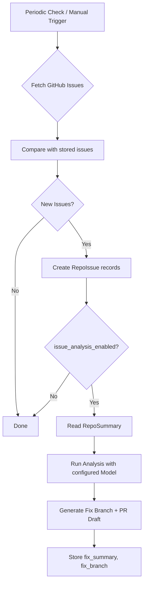

# Global Agents & Chat Redesign — Implementation Plan

> **Status:** Draft | **Date:** 2026-05-17
> Diese Design-Änderung restrukturiert das Agenten-, Chat- und Repository-System grundlegend.

---

## Overview

Fünf zusammenhängende Design-Änderungen:

1. **Agenten global** — Agenten sind nicht mehr Repo-spezifisch, sondern systemweit definiert
2. **Repo-Chats mit Agenten-Auswahl** — Aus der Repo-Ansicht heraus Chats mit beliebigem Agent starten
3. **Chat-Ansicht Redesign** — Nur Modelle im Chat; Repos als zuschaltbare "Tools" in Sidebar
4. **Issues pro Repo mit Auto-Analyse** — Offene Issues tracken; pro Repo definierbares Modell generiert Fix-Vorschläge
5. **Repo-Zusammenfassung** — Automatisches Einlesen & Summarizen für Token-Optimierung

---

## Data Model Changes

```mermaid
erDiagram
    users ||--o{ agents : "owns"
    users ||--o{ repositories : "owns"
    users ||--o{ chats : "owns"
    
    agents ||--o{ chats : "powers"
    agents {
        uuid id PK
        uuid user_id FK "NULL = system default"
        string name
        text description
        text system_prompt
        string model_provider
        string model_name
        jsonb tools_config
        bool is_default
        bool is_active
    }
    
    chats {
        uuid id PK
        uuid user_id FK
        uuid agent_id FK "NULL = general chat"
        string title
        string model_provider
        string model_name
        text system_prompt
    }
    
    chats ||--o{ chat_repositories : "has"
    chat_repositories {
        uuid chat_id PK_FK
        uuid repository_id PK_FK
    }
    repositories ||--o{ chat_repositories : "attached to"
    
    repositories ||--|| repo_summaries : "has"
    repo_summaries {
        uuid id PK
        uuid repository_id FK_UNIQUE
        text summary_text
        jsonb file_tree_json
        jsonb key_files_json
        jsonb languages_json
        int total_files
        bigint total_size
        timestamp last_indexed_at
        string content_hash
    }
    
    repositories ||--o{ repo_issues : "has"
    repo_issues {
        uuid id PK
        uuid repository_id FK
        bigint github_issue_id
        int number
        string title
        text body
        string state
        jsonb labels
        string assignee
        string html_url
        bool fix_generated
        text fix_summary
        string fix_branch
        string fix_model_used
    }
    
    repositories {
        uuid id PK
        uuid owner_id FK
        bigint github_repo_id
        string full_name
        string name
        text description
        string default_branch
        string current_branch
        text local_path
        string status
        bool is_private
        jsonb github_metadata
        string issue_analysis_model
        bool issue_analysis_enabled
    }
```

---

## 1. Global Agents System

### 1.1 Backend: Agent Model

**Neues Model:** [`backend/app/models/agent.py`](backend/app/models/agent.py)

| Column | Type | Description |
|--------|------|-------------|
| `id` | UUID PK | |
| `user_id` | UUID FK nullable | `NULL` = system default agent (shared, read-only) |
| `name` | String(255) | |
| `description` | Text | |
| `system_prompt` | Text | |
| `model_provider` | String(50) nullable | `ollama` / `openrouter`; NULL = inherit from chat |
| `model_name` | String(255) nullable | |
| `tools_config` | JSONB | Array of enabled tool names |
| `is_default` | Boolean | `True` = system template |
| `is_active` | Boolean | |
| `created_at` | DateTime | |
| `updated_at` | DateTime | |

**System-Agent seeds (5 Defaults):**

| ID | Name | Tools | Purpose |
|----|------|-------|---------|
| `software-architect` | Software Architect | read_file, list_files, search_in_files, get_git_log | Plan & Design |
| `code-reviewer` | Code Reviewer | read_file, list_files, search_in_files, get_git_diff, get_git_log | Review & Critique |
| `bug-fixer` | Bug Fixer | read_file, write_file, list_files, search_in_files, get_git_diff, get_git_log | Debug & Fix |
| `code-writer` | Code Writer | read_file, write_file, list_files, search_in_files, get_git_diff | Implement Features |
| `devops-helper` | DevOps Helper | read_file, list_files, write_file | CI/CD, Docker, Config |

Agent-Definitionen werden in [`backend/app/services/ai/agent_definitions.py`](backend/app/services/ai/agent_definitions.py) als Konstanten gespeichert und bei `init_db()` geseedet.

### 1.2 Backend: Chat Model Changes

**Änderungen an** [`backend/app/models/chat.py`](backend/app/models/chat.py):

- **Hinzufügen:** `agent_id` (UUID FK → agents.id, nullable)
- **Entfernen:** `is_agent_mode` (ersetzt durch `agent_id IS NOT NULL`)
- **Entfernen:** `repository_id` (ersetzt durch many-to-many `chat_repositories`)

### 1.3 Backend: Agent Endpoints

| Method | Path | Description |
|--------|------|-------------|
| `GET` | `/api/agents` | Alle Agents (system + user) |
| `GET` | `/api/agents/system` | Nur System-Default-Agents |
| `GET` | `/api/agents/my` | Nur eigene Agents |
| `POST` | `/api/agents` | Eigenen Agent erstellen |
| `GET` | `/api/agents/{id}` | Agent-Details |
| `PUT` | `/api/agents/{id}` | Agent updaten (nur eigene) |
| `DELETE` | `/api/agents/{id}` | Agent löschen (nur eigene) |

---

## 2. Repository Summary & Indexing

### 2.1 RepoSummary Model

Speichert eine strukturierte Zusammenfassung des Repositories, die als Kontext in Chats injiziert wird — statt jedes Mal das gesamte Repo zu analysieren.

**Indexing-Prozess (nach Clone):**

```
Repo Clone Complete
        │
        ▼
┌──────────────────────┐
│ Walk File Tree       │  → file_tree_json
│ Identify Key Files   │  → key_files_json (README, configs, main entry points)
│ Language Breakdown   │  → languages_json
│ Count Files & Sizes  │  → total_files, total_size
│ Generate NL Summary  │  → summary_text (via lightweight model)
│ Compute Hash         │  → content_hash (SHA-256 of tree state)
└──────────────────────┘
        │
        ▼
   Store in repo_summaries table
```

### 2.2 API

| Method | Path | Description |
|--------|------|-------------|
| `GET` | `/api/repositories/{id}/summary` | Get cached summary |
| `POST` | `/api/repositories/{id}/reindex` | Force re-index |

### 2.3 Token-Optimierung

- Statt 50+ Dateien zu lesen, liest der Agent 1 Summary (~500-2000 Tokens)
- Summary enthält: Dateibaum, Sprachen-Statistik, Dependency-Overview, Key Files
- Agent nutzt dann `read_file` nur für spezifische Dateien, die relevant sind

---

## 3. Issue Tracking & Auto-Analysis

### 3.1 Workflow



### 3.2 Repository Model Extensions

Neue Felder in [`backend/app/models/repository.py`](backend/app/models/repository.py):
- `issue_analysis_model` String nullable — welches Modell Issues analysiert
- `issue_analysis_enabled` Boolean default=False — Auto-Analyse ein/aus

### 3.3 Endpoints

| Method | Path | Description |
|--------|------|-------------|
| `GET` | `/api/repositories/{id}/issues` | Issues listen (von GitHub syncen) |
| `GET` | `/api/repositories/{id}/issues/{issue_id}` | Issue-Detail |
| `POST` | `/api/repositories/{id}/issues/sync` | Issues von GitHub syncen |
| `POST` | `/api/repositories/{id}/issues/{issue_id}/analyze` | Manuelle Analyse starten |
| `PATCH` | `/api/repositories/{id}/settings/issue-analysis` | Analyse-Konfiguration ändern |

---

## 4. Chat System Redesign

### 4.1 Konzept

```
┌──────────────────────────────────────────────────────────┐
│  ChatPage                                                │
│                                                          │
│  ┌────────────────────────────┐  ┌────────────────────┐  │
│  │  Chat Area                 │  │  Repository Tools  │  │
│  │                            │  │                    │  │
│  │  [Model Selector ▼]       │  │  ☑ repo-1 (main)   │  │
│  │                            │  │  ☐ repo-2 (utils)  │  │
│  │  ┌──────────────────────┐  │  │  ☐ repo-3 (docs)   │  │
│  │  │  Messages...         │  │  │                    │  │
│  │  │                      │  │  │  Active Repo:      │  │
│  │  │  AI responses        │  │  │  Summary injected  │  │
│  │  │  streaming...        │  │  │  as context        │  │
│  │  └──────────────────────┘  │  │                    │  │
│  │                            │  │  File Tools: ON    │  │
│  │  [Input................]   │  │                    │  │
│  │  [Send]                    │  │                    │  │
│  └────────────────────────────┘  └────────────────────┘  │
└──────────────────────────────────────────────────────────┘
```

### 4.2 Chat-Typen

| Typ | agent_id | chat_repositories | Beschreibung |
|-----|----------|-------------------|-------------|
| **General Chat** | NULL | empty | Nur Modell-Chat, keine Repo-Tools |
| **Agent Chat (no repo)** | gesetzt | empty | Agent-Persona, aber ohne Repo-Zugriff |
| **Agent Chat + Repos** | gesetzt | 1+ repos | Agent mit Repo-Tools |
| **Model Chat + Repos** | NULL | 1+ repos | Modell mit Repo-Tools, kein Agent |

### 4.3 How Repos work as "Tools"

1. User toggled Repos im "Repository Tools" Panel
2. Für jedes aktivierte Repo wird dessen [`RepoSummary`](#21-reposummary-model) als System-Kontext injiziert
3. Der Agent/Modell erhält Zugriff auf die File-Tools (`read_file`, `write_file`, etc.) für die aktivierten Repos
4. Jede Tool-Execution bekommt den `repo_full_name` als Scope mit

### 4.4 Chat Creation Flows

**Flow A: Aus Repo-Ansicht**
```
Repo Page → Click "Start Chat" → Agent Selection Modal → Create Chat → Navigate to Chat
```
- Chat wird mit `repository_id` in `chat_repositories` erstellt
- Agent wird aus Auswahl gesetzt

**Flow B: Aus Chat-Ansicht (New Chat Button)**
```
Chat Page → Click "New Chat" → Select Model → (Optional: Toggle Repos) → Chat startet
```
- Kein Agent (general chat) oder Agent später zuweisbar
- Repos werden über das Tools-Panel zugeschaltet

---

## 5. Frontend Changes

### 5.1 New/Changed Pages

| Page | Change |
|------|--------|
| [`AgentPage`](frontend/src/pages/AgentPage.tsx) | **Rewrite**: Zeigt System-Agents + eigene Agents; CRUD für eigene; "Clone" von System-Agents |
| [`ChatPage`](frontend/src/pages/ChatPage.tsx) | **Major Rewrite**: Zweigeteilt (Chat + Repo Tools Panel); keine Agent-Auswahl im Chat (nur Modelle) |
| [`RepositoriesPage`](frontend/src/pages/RepositoriesPage.tsx) | **Erweitern**: Issues-Tab; "Start Chat" Button → Agent-Selection Modal; Issue-Analyse-Konfiguration |

### 5.2 New Components

| Component | Purpose |
|-----------|---------|
| `RepoIssuesPanel` | Issues-Liste + Detail-Ansicht pro Repo |
| `AgentSelectionModal` | Modal zur Agent-Auswahl beim Chat-Start aus Repo |
| `RepoToolsPanel` | Sidebar im Chat: Repos als Toggle-Chips |
| `IssueAnalysisConfig` | Konfiguration des Analyse-Modells pro Repo |

### 5.3 New API Modules (Frontend)

- [`frontend/src/api/agents.ts`](frontend/src/api/agents.ts) — Agent CRUD
- [`frontend/src/api/issues.ts`](frontend/src/api/issues.ts) — Issue Sync & Analyse

### 5.4 Updated Types

Neue/geänderte Interfaces in [`frontend/src/types/index.ts`](frontend/src/types/index.ts):

```typescript
// NEW
interface Agent {
  id: string; user_id: string | null; name: string;
  description: string | null; system_prompt: string;
  model_provider: 'ollama' | 'openrouter' | null;
  model_name: string | null; tools_config: string[];
  is_default: boolean; is_active: boolean;
  created_at: string; updated_at: string;
}

interface RepoIssue {
  id: string; repository_id: string; github_issue_id: number;
  number: number; title: string; body: string | null;
  state: 'open' | 'closed'; labels: string[]; assignee: string | null;
  html_url: string; created_at: string; updated_at: string;
  fix_generated: boolean; fix_summary: string | null;
  fix_branch: string | null; fix_model_used: string | null;
}

interface RepoSummary {
  id: string; repository_id: string; summary_text: string;
  file_tree_json: any; key_files_json: any; languages_json: any;
  total_files: number; total_size: number;
  last_indexed_at: string; content_hash: string;
}

// MODIFIED
interface Chat {
  // REMOVED: is_agent_mode, repository_id
  // ADDED: agent_id, repositories (via chat_repositories)
  agent_id: string | null;
  repository_ids: string[];
}

interface Repository {
  // ADDED:
  issue_analysis_model: string | null;
  issue_analysis_enabled: boolean;
}
```

---

## 6. Implementation Order

Die Reihenfolge ist so gewählt, dass jeder Schritt unabhängig testbar ist:

```
Phase 1: Backend Foundation
  ├── 1.1 Agent Model + Migration
  ├── 1.2 Agent CRUD Endpoints
  ├── 1.3 System Agent Seeds
  ├── 1.4 Chat Model Changes (agent_id, chat_repositories)
  └── 1.5 RepoSummary Model + Indexing Service

Phase 2: Repo Features (Backend)
  ├── 2.1 RepoIssue Model
  ├── 2.2 Issue Sync + Analysis Service
  └── 2.3 Repository Model Extensions

Phase 3: Frontend Agent Management
  ├── 3.1 Agent Types + API Module
  ├── 3.2 AgentPage Rewrite
  └── 3.3 AgentForm/AgentCard Updates

Phase 4: Frontend Repo View
  ├── 4.1 Issues Panel
  ├── 4.2 Agent Selection Modal
  └── 4.3 Issue Analysis Config

Phase 5: Frontend Chat Redesign
  ├── 5.1 RepoToolsPanel
  ├── 5.2 ChatPage Split Layout
  └── 5.3 Multi-Repo Context Injection

Phase 6: Integration
  ├── 6.1 AgentRunner Update
  ├── 6.2 End-to-End Flow Testing
  └── 6.3 Polish & Error Handling
```

---

## 7. Key Design Decisions

| Decision | Rationale |
|----------|-----------|
| Agent `user_id=NULL` für System-Defaults | Einmal definiert, alle User nutzen sie; keine Duplikation |
| `chat_repositories` M:N statt 1:1 | Mehrere Repos als Kontext in einem Chat möglich |
| RepoSummary als separate Tabelle | Cached, nicht bei jedem Chat-Start neu berechnen |
| Issue-Analyse-Modell pro Repo konfigurierbar | Unterschiedliche Projekte brauchen unterschiedliche Modelle |
| Agent-Tools als `tools_config` JSONB Array | Flexibel; neue Tools können ohne Migration hinzugefügt werden |
| `agent_id=NULL` = General Chat | Klare Trennung: mit Agent = Persona, ohne = reines Modell |
